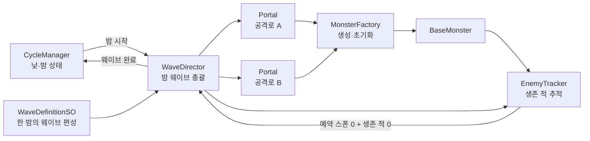

# 포탈 시스템 설계·구현 계획 및 진행 현황

> 대상 이슈: GitHub Issue #9 `[Feature] 포탈`  
> 문서 목적: 포탈·웨이브·밤 진행 시스템을 단계적으로 구현하기 위한 설계 및 작업 기준  
> 기획 기준: `Docs/기획종합_v2.md`  
> 최종 현황 갱신: 2026-07-13  
> 상태: 포탈 씬 골격 완료, 웨이브 데이터 계약 보완 전

---

## 0. 다른 세션용 인수인계 요약

이 문서는 포탈 시스템의 전체 설계와 실제 구현 진행 상황을 함께 관리한다. 다른 AI 또는 팀원이 작업을 이어갈 때는 문서 내용만으로 구현 완료를 가정하지 말고 아래 코드와 씬을 먼저 대조한다.

### 0.1 현재 소스 오브 트루스

- 기획: `Docs/기획종합_v2.md`
- 작업 계획 및 진행 현황: 이 문서
- 포탈 코드: `Assets/Scripts/Portal/Portal.cs`, `PortalId.cs`
- 웨이브 데이터 코드: `Assets/Scripts/Wave/`
- 포탈 테스트 씬: `Assets/Scenes/Sangwook_PortalScene.unity`
- 기존 테스트 스폰 방식: `Assets/Scripts/Monster/MonsterSpawnTester.cs`
- 적 초기화 진입점: `Assets/Scripts/Monster/BaseMonster.cs`의 `Setup`

### 0.2 현재 구현 상태 요약

| 영역 | 상태 | 현재 내용 |
|---|---|---|
| 포탈 식별자 | 완료 | `None`, `North`, `East`, `South`, `West` 정의 |
| 포탈 컴포넌트 | 골격 완료 | ID, 스폰 위치, 지상 경로, 메인 성, 활성 여부 및 설정 확인 프로퍼티 구현 |
| 테스트 씬 | 기본 연결 완료 | 포탈 4개, 스플라인 4개, 메인 성 생성 및 참조 연결 |
| 스폰 그룹 데이터 | 초안 | 필드와 프로퍼티는 있으나 직렬화 일반 클래스로 수정 필요 |
| 포탈별 웨이브 데이터 | 초안 | 필드와 프로퍼티는 있으나 직렬화 구조와 명칭 수정 필요 |
| 최상위 웨이브 에셋 | 초안 | 필드는 있으나 `ScriptableObject` 상속 수정 필요 |
| 데이터 검증 | 미구현 | 누락 참조, 수량, 간격, 중복 포탈 검사 필요 |
| 웨이브 실행 | 미구현 | `WaveDirector`, 코루틴 및 취소 처리 없음 |
| 적 생성 | 미구현 | 실제 시스템용 `MonsterFactory` 없음 |
| 생존 적 추적 | 미구현 | `EnemyTracker`와 웨이브 완료 조건 없음 |
| 낮·밤 연결 | 미구현 | `CycleManager`와 웨이브 연결 전 |

### 0.3 완료된 코드 작업

#### `PortalId`

파일: `Assets/Scripts/Portal/PortalId.cs`

- 미설정 상태를 나타내는 `None` 정의
- 동서남북 네 포탈을 나타내는 값 정의
- 웨이브 데이터와 씬 포탈을 연결할 고정 식별자로 사용 예정
- 역할을 설명하는 XML `<summary>` 작성 완료

#### `Portal`

파일: `Assets/Scripts/Portal/Portal.cs`

현재 다음 직렬화 필드를 보관한다.

```text
PortalId _id
Transform _spawnPoint
SplineContainer _groundPath
Transform _mainCastle
bool _isActive
```

외부 시스템은 읽기 전용 프로퍼티로 해당 값을 조회한다. `IsConfigured`는 다음 조건이 모두 충족됐는지 확인한다.

- `PortalId.None`이 아님
- 스폰 위치가 연결됨
- 지상 경로가 연결됨
- 메인 성이 연결됨

`Portal`은 현재 날짜, 주기, 웨이브 선택 및 적 생성 여부를 직접 판단하지 않는다. 이후 `WaveDirector`와 `MonsterFactory`가 사용할 씬 정보 제공자 역할을 맡는다.

### 0.4 완료된 씬 작업

파일: `Assets/Scenes/Sangwook_PortalScene.unity`

씬에 다음 임시 오브젝트가 구성되어 있다.

```text
Portal_North ─ Spline_North ┐
Portal_East  ─ Spline_East  ├─ MainCastle
Portal_South ─ Spline_South ┤
Portal_West  ─ Spline_West  ┘
```

- 포탈 4개에 `Portal` 컴포넌트 연결
- 각 포탈에 중복되지 않는 방향별 `PortalId` 지정
- 각 포탈의 스폰 위치 연결
- 포탈별로 서로 다른 `SplineContainer` 연결
- 네 포탈 모두 같은 `MainCastle` 참조

현재 씬에 직렬화된 네 포탈의 `_isActive` 값은 모두 `false`다. 첫 실행 테스트 전 하나의 포탈만 임시 활성화해야 한다. 어떤 방향을 먼저 사용할지는 개발 검증용 선택이며 기획 확정값으로 취급하지 않는다.

### 0.5 생성된 웨이브 데이터 초안

다음 파일이 생성되어 있다.

- `Assets/Scripts/Wave/SpawnGroupData.cs`
- `Assets/Scripts/Wave/PortalWaveData.cs`
- `Assets/Scripts/Wave/WaveDefinitionSO.cs`

의도한 데이터 계층은 다음과 같다.

```text
WaveDefinitionSO
└─ PortalWaveData[]
   ├─ PortalId
   ├─ StartDelay
   └─ SpawnGroupData[]
      ├─ MonsterPrefab
      ├─ MonsterData
      ├─ SpawnCount
      ├─ SpawnInterval
      └─ DelayAfterGroup
```

현재 파일은 생성됐지만 다음 보완 없이는 의도한 중첩 데이터 에셋으로 사용할 수 없다.

- `SpawnGroupData`는 `MonoBehaviour`가 아니라 `[Serializable]` 일반 클래스여야 한다.
- `PortalWaveData`도 `MonoBehaviour`가 아니라 `[Serializable]` 일반 클래스여야 한다.
- `WaveDefinitionSO`는 `MonoBehaviour`가 아니라 `ScriptableObject`를 상속해야 한다.
- `PortalWaveData._startDay`는 포탈 실행 시작 지연을 의미하므로 `_startDelay`로 변경해야 한다.
- `PortalWaveData.PortaId` 오타는 `PortalId`로 수정해야 한다.
- 컬렉션 프로퍼티 `SpawnGroup`은 `SpawnGroups`로 수정해야 한다.
- `Portal`과 웨이브 데이터 3종에 역할을 설명하는 XML `<summary>`를 추가해야 한다.

### 0.6 바로 다음 작업

다음 구현 단위는 **웨이브 데이터 계약 3종 완성**이다.

1. `SpawnGroupData`를 `[Serializable]` 일반 클래스로 수정한다.
2. `PortalWaveData`를 `[Serializable]` 일반 클래스로 수정하고 필드·프로퍼티 명칭을 정리한다.
3. `WaveDefinitionSO`가 `ScriptableObject`를 상속하도록 수정한다.
4. 각 타입에 간략한 XML `<summary>`를 작성한다.
5. Unity 컴파일 오류가 없는지 확인한다.
6. 테스트용 `WaveDefinitionSO` 에셋을 생성한다.
7. Inspector에서 포탈 편성과 스폰 그룹이 중첩 표시되는지 확인한다.

이 작업에서는 아직 `MonsterFactory`, `WaveDirector`, 실제 적 생성, `CycleManager` 연결을 구현하지 않는다.

### 0.7 아직 결정이 필요한 항목

- `RunData.currentCycle`이 누적 일차인지 큰 단위 주기인지
- 첫 실행 테스트에 사용할 적 프리팹과 `MonsterData`
- 테스트용 스폰 수량과 간격
- 적이 메인 성에 도착했을 때 생존 적 집계에서 빠지는 시점
- 밤 중단 또는 패배 시 이미 생성된 적의 처리 정책

위 항목은 웨이브 데이터 계약을 완성하는 데는 필요하지 않다. 자동 웨이브 선택과 밤 종료를 연결하기 전에 확정한다.

---

## 1. 작업 목표

밤이 시작되면 활성화된 포탈에서 해당 밤에 편성된 적이 정해진 순서와 간격으로 등장하고, 포탈별 공격로를 따라 메인 성으로 이동하도록 한다.

단순한 테스트용 스포너를 만드는 데 그치지 않고, 이후 다음 기능을 기존 구조를 크게 변경하지 않고 추가할 수 있는 기반을 마련한다.

- 네 포탈의 순차 활성화
- 한 웨이브 내 복수 포탈 동시 운용
- 여러 적 종류와 보스 편성
- 점령 상태에 따른 난이도 변화
- 포탈 봉인과 조기 승리
- 스폰 예고 UI 및 연출
- 오브젝트 풀링
- 저장·불러오기

이번 이슈의 일차 목표는 **밤 시작부터 웨이브 완료까지 이어지는 최소 수직 흐름**을 완성하는 것이다.

```text
낮 종료
→ 밤 시작
→ 오늘의 웨이브 선택
→ 활성 포탈에 스폰 명령 전달
→ 적 생성 및 이동
→ 모든 예약 스폰 완료
→ 생성된 적 전멸
→ 웨이브 완료
→ 밤 종료
```

---

## 2. 기획 기준과 작업 경계

### 2.1 확정된 내용

`Docs/기획종합_v2.md`를 기준으로 다음 내용은 확정 사항으로 취급한다

- 포탈은 동서남북에 총 4개 존재한다.
- 각 포탈은 적이 출발하는 공격로의 시작점이다.
- 지상 적은 포탈별 고정 경로를 따라 메인 성으로 이동한다.
- 밤에는 포탈에서 적 웨이브가 진입한다.
- 그날 등장한 모든 적을 격퇴하면 밤 방어에 승리한다.
- 주기가 끝날 때마다 새로운 포탈이 활성화된다.
- 첫 주기에는 포탈 1개, 마지막 주기에는 포탈 4개가 활성화된다.
- 주기 마지막 날에는 보스 웨이브가 등장한다.
- 네 포탈을 모두 봉인하면 조기 승리가 가능하다.

### 2.2 아직 확정되지 않은 내용

다음 내용은 기획서에서 `[미정]`으로 표시되어 있으므로 임의로 공식화하지 않는다.

- 주기당 일수
- 적과 보스의 상세 종류 및 능력치
- 날짜·주기별 웨이브 공식
- 점령지 가치에 따른 적 난이도 증가 공식
- 보스 4종의 상세 구성
- 포탈 봉인석 비용 등 경제 수치

초기 구현에서는 미정인 공식을 코드에 넣지 않고, ScriptableObject에 직접 작성한 명시적 웨이브 데이터를 실행한다. 공식이 확정되면 웨이브 데이터를 자동 생성하는 별도 전략을 추가한다.

### 2.3 이번 이슈에 포함할 범위

- 포탈별 식별자, 스폰 위치, 이동 경로 참조
- ScriptableObject 기반 웨이브 편성 데이터
- 밤 시작 이벤트와 웨이브 실행 연결
- 지정 수량·간격·순서에 따른 적 생성
- 지상·공중 이동에 필요한 참조 주입
- 예약 스폰 수와 생존 적 수 추적
- 모든 적 전멸에 따른 웨이브 완료 판정
- 밤 중단 및 오브젝트 비활성화 시 스폰 취소
- 데이터 누락과 잘못된 설정에 대한 검증

### 2.4 이번 이슈에서 제외할 범위

- 웨이브 자동 난이도 계산 공식
- 보스 고유 행동 구현
- 포탈 봉인 건물 및 조기 승리 구현
- 스폰 연출·음향·최종 UI
- 오브젝트 풀링의 실제 적용
- 밤 도중 저장·불러오기
- 적의 메인 성 공격 상세 로직

제외 범위에 필요한 연결 지점은 고려하되, 아직 필요하지 않은 시스템을 미리 구현하지 않는다.

---

## 3. 현재 프로젝트 기반

새 시스템은 다음의 기존 구조를 재사용한다.

| 기존 구성 | 현재 역할 | 포탈 시스템에서의 사용 |
|---|---|---|
| `CycleManager` | 낮·밤 전환 및 이벤트 발행 | 밤 시작과 밤 종료 연결 |
| `MonsterData` | 적 한 종류의 스탯 데이터 | 웨이브가 출현시킬 적 데이터 |
| `BaseMonster` | 적 컴포넌트 초기화 및 생명주기 조율 | 생성 직후 데이터·경로·성 참조 주입 |
| `MonsterMovement` | 이동 전략 공통 기반 | 지상·공중 이동 전략 유지 |
| `GroundSplineMovement` | 스플라인 경로 이동 | 포탈별 지상 공격로 주입 |
| `AirDirectMovement` | 메인 성 직선 이동 | 포탈 경로와 무관하게 성 목표 주입 |
| `MonsterSpawnTester` | 테스트용 단일 적 스폰 | 실제 시스템 완성 후 테스트 전용 유지 또는 제거 검토 |

현재 적 이동은 전략 패턴으로 분리되어 있으므로 포탈 시스템이 적의 구체 이동 타입을 직접 판별하거나 이동시키지 않는다. 포탈 시스템은 필요한 참조를 `BaseMonster.Setup`에 전달하는 역할만 수행한다.

---

## 4. 권장 아키텍처

### 4.1 전체 흐름



### 4.2 책임 분리 원칙

- `CycleManager`는 낮과 밤의 상태만 관리한다.
- `WaveDirector`는 한 번의 밤 웨이브 전체를 조율한다.
- `Portal`은 한 공격로의 씬 참조와 스폰 실행만 담당한다.
- 웨이브 ScriptableObject는 편성 데이터만 보관한다.
- `MonsterFactory`는 적 생성과 초기화 방법을 캡슐화한다.
- `EnemyTracker`는 현재 살아 있는 적을 추적한다.
- `BaseMonster`는 자신의 전투·이동·사망 생명주기만 관리한다.

어느 한 클래스도 날짜 계산, 데이터 선택, 적 생성, 생존 수 추적, 밤 종료를 모두 맡지 않도록 한다.

---

## 5. 구성 요소 상세 설계

### 5.1 `PortalId`

포탈을 씬 오브젝트 이름이나 배열 인덱스로 식별하지 않기 위한 고정 식별자다.

예상 값:

- North
- East
- South
- West

웨이브 데이터와 씬의 포탈을 연결하는 계약으로 사용한다. 방향 명칭이 최종 맵 배치와 맞지 않는다면 구현 전에 기획 담당자와 식별 명칭을 확정한다.

### 5.2 `Portal`

씬에 배치되는 포탈 한 개의 런타임 표현이다.

보관할 참조:

- `PortalId`
- 적 생성 위치 `Transform`
- 지상 적용 `SplineContainer`
- 메인 성 `Transform`
- 활성 여부
- 향후 봉인 상태 연결 지점

담당할 동작:

- 자신의 설정 유효성 검사
- 전달받은 적 생성 요청 실행
- 자신의 위치·경로·메인 성 참조를 팩토리에 전달

담당하지 않을 동작:

- 오늘 사용할 웨이브 결정
- 현재 날짜 또는 주기 계산
- 다른 포탈 활성화 결정
- 전체 밤 종료 판정
- 자동 난이도 계산

### 5.3 `WaveDefinitionSO`와 중첩 데이터

`WaveDefinitionSO`는 한 번의 밤에 실행할 포탈별 편성을 보관하는 ScriptableObject다. 현재 단계에서는 날짜·주기 선택 책임을 포함하지 않는다. 이후 별도의 스케줄 또는 진행 시스템이 실행할 `WaveDefinitionSO`를 선택한다.

권장 데이터 계층:

```text
WaveDefinitionSO
└─ PortalWaveData[]
   ├─ PortalId
   ├─ StartDelay
   └─ SpawnGroupData[]
      ├─ MonsterPrefab
      ├─ MonsterData
      ├─ SpawnCount
      ├─ SpawnInterval
      └─ DelayAfterGroup
```

적 능력치인 `MonsterData`에는 출현 수량·간격을 추가하지 않는다. 적 스탯과 웨이브 편성은 서로 다른 책임이며 서로 다른 주기로 변경된다.

프리팹과 `MonsterData`를 항상 올바른 조합으로 사용해야 한다면 다음 중 하나를 선택한다.

1. 초기안: `SpawnGroupData`가 프리팹과 `MonsterData`를 함께 참조한다.
2. 확장안: `MonsterDefinitionSO`가 프리팹과 `MonsterData`의 짝을 정의하고 웨이브에서는 정의 에셋 하나만 참조한다.

장기적으로는 두 번째 방식이 안전하지만, 현재 적 데이터 파이프라인과 팀 작업량을 확인한 후 결정한다.

### 5.4 `WaveDirector`

한 번의 밤 웨이브를 총괄하는 오케스트레이터다.

주요 책임:

- `CycleManager.OnNightStart` 구독
- 현재 진행 정보에 맞는 웨이브 데이터 선택
- 씬 포탈을 `PortalId`로 조회
- 활성 포탈에 스폰 그룹 실행 요청
- 남아 있는 예약 스폰 수 관리
- 생존 적 추적기 상태 확인
- 웨이브 완료 이벤트를 한 번만 발행
- 밤 중단·패배·파괴 시 실행 중인 작업 취소

권장 런타임 상태:

```text
Idle
→ Spawning
→ WaitingForEnemies
→ Completed

어느 상태에서든 중단 발생
→ Cancelled
```

상태 전환을 명시하면 중복 밤 종료, 이전 밤 코루틴 잔존, 중복 웨이브 실행을 방지하기 쉽다. 초기 구현에서는 enum과 단일 오케스트레이터로 충분하며 상태별 클래스로 과도하게 분리하지 않는다.

### 5.5 `MonsterFactory`

적 생성과 초기화 책임을 포탈에서 분리한다.

초기 책임:

- 적 프리팹 생성
- 생성 위치 적용
- `BaseMonster.Setup` 호출
- 생성된 적 반환

초기 버전에서는 `Instantiate`를 사용한다. 나중에 동시 적 수와 프로파일링 결과에 따라 동일한 생성 계약의 구현을 오브젝트 풀 방식으로 교체한다.

풀링을 고려해 포탈이나 웨이브 디렉터가 직접 `Instantiate` 또는 `Destroy` 정책에 의존하지 않도록 한다.

### 5.6 `EnemyTracker`

현재 밤에 생성된 적의 생존 상태를 추적한다.

웨이브 완료 조건:

```text
남아 있는 예약 스폰 수 == 0
AND
현재 생존 적 수 == 0
```

마지막 적을 생성한 순간이 아니라 마지막 적이 실제로 제거된 순간에 웨이브가 완료되어야 한다.

추적 대상이 해제되는 경우:

- 체력이 0이 되어 사망
- 메인 성 도달 후 공격 상태로 전환되거나 제거
- 패배·씬 종료·밤 취소로 강제 제거
- 향후 오브젝트 풀로 반환

씬 전체를 반복 검색하여 적 수를 세지 않고, 생성 시 등록하고 종료 시 해제하는 이벤트 기반 방식을 사용한다.

`BaseMonster`의 종료 이벤트 계약은 사망뿐 아니라 풀 반환과 강제 제거까지 표현할 수 있도록 검토한다. 단, 이번 단계에서 필요 이상의 범용 이벤트 체계를 만들지는 않는다.

---

## 6. 적용 디자인 패턴

| 패턴 | 적용 위치 | 목적 |
|---|---|---|
| Strategy | 기존 `MonsterMovement` | 지상·공중 등 이동 방식 교체 |
| Observer | 밤 시작, 적 제거, 웨이브 완료 | 시스템 간 직접 참조 최소화 |
| Factory | `MonsterFactory` | 생성·초기화 및 향후 풀링 교체 |
| Data-driven | 웨이브 ScriptableObject | 코드 수정 없이 편성 변경 |
| State | `WaveDirector` 런타임 상태 | 중복 실행·완료·취소 방지 |
| Dependency Injection | 생성자/초기화 메서드/인스펙터 참조 | 전역 검색과 숨은 의존성 방지 |

이번 시스템만을 위해 전역 이벤트 버스, 서비스 로케이터, 범용 DI 프레임워크를 도입하지 않는다. 현재 프로젝트 규모에서는 명시적인 참조와 작은 인터페이스가 더 추적하기 쉽다.

---

## 7. `CycleManager` 연동 전 점검

현재 `CycleManager`에는 포탈 시스템을 연결하기 전에 확인해야 할 사항이 있다.

- `StartNight`가 `CurrentCycle`을 `Night`로 변경하기 전에 `OnNightStart`를 호출한다.
- `StartDay`도 상태를 변경하기 전에 시작 이벤트를 호출한다.
- `EndNight`에서 `OnNightEnd`가 호출되지 않는다.
- `RunData.currentCycle`이 누적 일차인지 큰 단위의 주기인지 이름만으로 불분명하다.
- 밤 종료가 중복 호출되는 것을 방지하는 상태 검사가 없다.

권장 이벤트 순서:

```text
현재 상태 변경
→ 해당 상태 시작 이벤트 발행
→ 상태를 사용하는 시스템 실행
```

포탈 시스템 구현 전에 다음 용어를 구분한다.

- `DayIndex`: 누적 일차
- `CycleIndex`: 현재 큰 주기
- `DayInCycle`: 현재 주기 안의 일차
- `WaveId`: 실행할 웨이브의 고정 식별자

주기당 일수가 아직 미정이므로 이번 작업에서 주기 계산 공식을 확정하지 않는다. 첫 수직 슬라이스는 고정 테스트 웨이브 또는 명시적으로 전달받은 `WaveId`로 실행할 수 있다.

---

## 8. 오류 처리와 데이터 검증

런타임에서 조용히 실패하지 않도록 다음 항목을 검증한다.

### 8.1 포탈 검증

- `PortalId` 중복
- 스폰 위치 누락
- 지상 경로 누락
- 메인 성 참조 누락
- 웨이브에 지정된 포탈이 씬에 없음
- 비활성 또는 봉인 포탈에 스폰 편성이 할당됨

### 8.2 웨이브 데이터 검증

- 웨이브 식별자 중복
- 포탈 편성 안의 `PortalId` 중복
- 적 프리팹 또는 데이터 누락
- 스폰 수량이 유효하지 않음
- 스폰 간격이나 지연 시간이 음수
- 편성이 하나도 없는 밤

### 8.3 런타임 보호

- 이미 실행 중일 때 밤 시작 이벤트가 다시 들어오는 경우
- 웨이브 완료 이벤트가 여러 번 발생하는 경우
- 포탈 또는 디렉터가 비활성화될 때 코루틴이 남는 경우
- 적 생성 도중 패배 또는 씬 전환이 발생하는 경우
- 추적 중인 적이 예외적인 경로로 파괴되는 경우

검증 메시지는 `Debug.Log` 또는 예외 메시지이므로 프로젝트의 문자열 리터럴 예외 규칙을 적용할 수 있다. 게임 UI에 표시되는 메시지는 스트링테이블 키를 사용한다.

---

## 9. 비동기 실행과 취소 정책

현재 요구 규모에서는 코루틴으로 스폰 간격을 처리해도 충분하다. UniTask가 설치되어 있다는 이유만으로 기존 흐름에 새로운 비동기 방식을 섞지 않는다.

코루틴 사용 시 다음 규칙을 지킨다.

- 실행 중인 코루틴 참조를 보관한다.
- 밤 종료, 패배, 디렉터 비활성화, 씬 종료 시 중단한다.
- 중단 후 남은 예약 스폰 수를 정리한다.
- 이전 밤의 코루틴이 다음 밤에 영향을 주지 않도록 실행 세대를 구분한다.
- `Time.timeScale`이 0일 때 스폰이 멈추는 것이 의도인지 확인한다.

일반 게임 일시정지 동안 웨이브도 멈추는 정책이라면 `WaitForSeconds`가 적합하다. 일시정지와 무관하게 진행해야 하는 특별한 연출이 확정될 경우에만 실시간 대기를 검토한다.

---

## 10. 제안 파일 구조

실제 구현 시 현재 폴더 구조와 팀 담당 범위를 다시 확인하되, 다음과 같이 책임별로 배치하는 것을 권장한다.

```text
Assets/
├─ Scripts/
│  ├─ Portal/
│  │  ├─ Portal.cs
│  │  └─ PortalId.cs
│  ├─ Wave/
│  │  ├─ SpawnGroupData.cs
│  │  ├─ PortalWaveData.cs
│  │  ├─ WaveDefinitionSO.cs
│  │  ├─ WaveDirector.cs          # 예정
│  │  ├─ EnemyTracker.cs          # 예정
│  │  └─ MonsterFactory.cs        # 예정
│  └─ Monster/
│     └─ 기존 적 시스템
├─ Data/
│  └─ Wave/
│     └─ 프로토타입 웨이브 에셋
└─ Prefabs/
   └─ Portal/
      └─ 포탈 프리팹
```

현재 팀 결정에 따라 `SpawnGroupData`, `PortalWaveData`, `WaveDefinitionSO`는 각각 별도 파일로 관리한다. 데이터 계층이 확장될 때 각 타입의 책임과 변경 이력을 분리하기 위한 선택이다.

---

## 11. 단계별 구현 계획

### 단계 0 — 구현 전 합의

목표: 미정 기획을 임의로 결정하지 않고 첫 테스트 조건만 확정한다.

- [x] 테스트 씬에 포탈 4개 골격 구성
- [ ] 첫 테스트 포탈의 고정 식별자 결정
- [ ] 첫 웨이브의 적 프리팹과 `MonsterData` 결정
- [ ] 첫 웨이브의 수량·간격 결정
- [ ] 적이 메인 성 도달 시 생존 적 추적에서 빠지는 시점 결정
- [ ] 밤 중단·패배 시 생성된 적 처리 정책 결정
- [ ] `currentCycle`의 실제 의미 확인
- [x] 포탈 시스템 담당 테스트 씬 확인 (`Sangwook_PortalScene`)

산출물:

- 구현에 사용할 한 개의 구체적인 테스트 시나리오
- 용어와 이벤트 순서 합의

### 단계 1 — 데이터와 계약 정의

목표: 씬 동작보다 먼저 책임 경계와 데이터 구조를 고정한다.

- [x] `PortalId` 정의
- [ ] 웨이브 직렬화 데이터 정의
- [ ] `WaveDefinitionSO` 정의
- [ ] 스폰에 사용할 적 정의 방식 결정
- [ ] 데이터 검증 메서드 또는 `OnValidate` 추가
- [ ] 숫자 리터럴을 직렬화 필드 또는 명명된 상수로 관리
- [ ] Inspector 설명에 필요한 `Tooltip` 작성

검증:

- 코드 컴파일 오류 0
- 테스트용 웨이브 에셋 생성 가능
- 잘못된 수량·간격·누락 참조 검출 가능

### 단계 2 — 단일 포탈 수직 슬라이스

목표: 한 개 포탈에서 한 종류의 적을 생성하고 기존 경로 이동에 연결한다.

- [x] `Portal` 씬 참조 제공 골격 구현
- [ ] 최소 `MonsterFactory` 구현
- [ ] 테스트 웨이브 한 개 생성
- [ ] 단일 스폰 그룹 실행
- [ ] 포탈 위치에서 생성
- [ ] `BaseMonster.Setup`에 경로와 성 참조 전달
- [ ] 지정 수량과 간격 확인
- [ ] 실행 중 취소 처리

검증 시나리오:

```text
밤 시작
→ 포탈 1개에서 기본 지상 적 N마리 생성
→ 각 적이 동일한 포탈 경로를 따라 이동
→ 생성 수와 간격이 데이터와 일치
```

### 단계 3 — 적 추적과 웨이브 완료

목표: 생성 완료와 전멸을 구분하여 밤 완료 조건을 만든다.

- [ ] `EnemyTracker` 구현
- [ ] 생성 시 적 등록
- [ ] 사망·제거 시 등록 해제
- [ ] 남은 예약 스폰 수 추적
- [ ] 완료 조건을 한 곳에서 판정
- [ ] 완료 이벤트 중복 발행 방지
- [ ] 강제 종료 시 추적 상태 초기화

검증 시나리오:

- 마지막 적이 생성되어도 살아 있으면 완료되지 않는다.
- 모든 적이 죽어도 예약 스폰이 남아 있으면 완료되지 않는다.
- 예약 스폰과 생존 적이 모두 0일 때 한 번만 완료된다.

### 단계 4 — `CycleManager` 연동

목표: 실제 낮·밤 흐름에서 웨이브가 시작되고 종료되도록 한다.

- [ ] 상태 변경과 이벤트 발행 순서 정리
- [ ] `OnNightEnd` 누락 처리
- [ ] `WaveDirector`가 밤 시작 이벤트를 구독
- [ ] 현재 진행 정보에 맞는 웨이브 선택
- [ ] 웨이브 완료 시 밤 종료 요청
- [ ] 중복 밤 종료 방지
- [ ] 낮 전환 후 이전 밤 상태 초기화 확인

검증 시나리오:

```text
낮 종료 버튼
→ Night 상태 확정
→ 웨이브 시작
→ 적 전멸
→ Night 종료 이벤트
→ 다음 Day 시작
```

### 단계 5 — 복수 포탈과 복합 편성

목표: 이슈 #9의 실제 포탈 구성을 지원한다.

- [x] 씬의 포탈 4개에 서로 다른 `PortalId` 지정
- [ ] 중복 ID 검출
- [x] 포탈별 서로 다른 스플라인 연결
- [ ] 여러 스폰 그룹 순차 실행
- [ ] 포탈별 시작 지연 적용
- [ ] 복수 포탈 동시 스폰
- [ ] 비활성 포탈 제외
- [ ] 공중 적의 메인 성 직접 이동 검증

검증 시나리오:

- 포탈별 적이 다른 경로로 이동한다.
- 한 포탈의 완료가 전체 밤을 조기 종료하지 않는다.
- 비활성 포탈에서는 적이 생성되지 않는다.
- 여러 포탈의 모든 예약과 생존 적이 끝나야 완료된다.

### 단계 6 — 안정화 및 에디터 검증

목표: 팀원이 데이터를 추가해도 설정 오류를 빠르게 발견할 수 있게 한다.

- [ ] 누락 참조 경고 정리
- [ ] Inspector 데이터 가독성 점검
- [ ] EditMode 테스트 작성
- [ ] PlayMode 테스트 작성
- [ ] 씬 재시작 및 비활성화 테스트
- [ ] 낮·밤 반복 실행 테스트
- [ ] 컴파일 오류 0 확인
- [ ] 플레이 모드 진입 가능 확인
- [ ] Coplay MCP로 씬·프리팹 wiring 확인
- [ ] 기존 `MonsterSpawnTester` 유지 또는 제거 결정

---

## 12. 테스트 계획

### 12.1 EditMode 테스트

- 같은 `PortalId`가 두 번 등록되면 실패한다.
- 스폰 수량이 유효하지 않으면 실패한다.
- 간격 또는 지연 시간이 음수이면 실패한다.
- 적 프리팹이나 데이터 참조가 없으면 실패한다.
- 웨이브 식별자가 중복되면 실패한다.
- 같은 웨이브 안에서 포탈 편성이 중복되면 실패한다.
- 존재하지 않는 웨이브 조회 결과가 명확하다.

### 12.2 PlayMode 테스트

- 밤 시작 전에는 적이 생성되지 않는다.
- 밤 시작 후 정확한 수량이 생성된다.
- 설정한 시간 간격의 허용 오차 안에서 생성된다.
- 지상 적은 지정된 포탈 경로로 이동한다.
- 공중 적은 메인 성을 향해 이동한다.
- 마지막 적 생성만으로 웨이브가 끝나지 않는다.
- 마지막 적 제거 후 웨이브가 한 번만 끝난다.
- 여러 포탈 중 한 곳만 끝나도 전체 웨이브는 유지된다.
- 밤 취소 후 추가 적이 생성되지 않는다.
- 오브젝트 비활성화와 씬 종료 후 이벤트 구독이 남지 않는다.
- 여러 번의 낮·밤 반복에서 이전 웨이브 상태가 섞이지 않는다.

### 12.3 수동 플레이 테스트

- 포탈 위치와 적 생성 위치가 시각적으로 일치하는가?
- 적이 경로 시작점으로 순간 이동하는 현상이 없는가?
- 서로 다른 포탈의 경로가 뒤바뀌지 않는가?
- 대량 스폰 시 프레임 저하가 발생하는가?
- 일시정지 중 스폰과 이동이 의도대로 멈추는가?
- 밤 종료 직후 남은 적 또는 코루틴이 존재하지 않는가?

---

## 13. 장기 확장 방향

### 13.1 포탈 순차 활성화

`Portal`은 활성 상태를 표현하고 `WaveDirector`는 활성 포탈에만 편성을 전달한다. 주기별 활성화 규칙은 별도 진행 시스템에서 결정한다. 포탈 자체가 현재 주기를 계산하지 않는다.

### 13.2 포탈 봉인

향후 포탈 상태는 다음처럼 확장할 수 있다.

```text
Locked
Active
Sealed
```

- `Locked`: 아직 해당 주기에 개방되지 않음
- `Active`: 웨이브가 출현할 수 있음
- `Sealed`: 플레이어가 봉인하여 출현하지 않음

네 포탈의 봉인 완료 여부는 승리 판정 시스템이 확인한다. 포탈이 직접 게임 승리를 선언하지 않는다.

### 13.3 웨이브 자동 생성

공식 확정 후 다음 입력을 받아 `WaveDefinitionSO`와 동일한 실행 형식을 만드는 생성 전략을 추가할 수 있다.

- 현재 주기
- 현재 일차
- 활성 포탈 수
- 점령지 가치
- 난이도 설정
- 보스 여부

수동 ScriptableObject와 자동 생성 결과가 같은 실행 모델을 사용하면 `WaveDirector`를 변경하지 않고 생성 방식만 교체할 수 있다.

### 13.4 오브젝트 풀링

프로파일링에서 `Instantiate/Destroy` 비용이 확인된 뒤 `MonsterFactory` 내부를 풀 기반 구현으로 교체한다.

풀링 도입 전 확인할 사항:

- `BaseMonster`의 체력·방어막·이동 거리 초기화
- 이벤트 구독의 중복 방지
- 상태 효과와 공격 쿨다운 초기화
- 적 추적 등록·해제
- 풀 반환과 실제 사망의 의미 구분

### 13.5 저장·불러오기

프로토타입에서는 낮 시작 시점 저장을 우선한다. 밤 도중 저장이 필요해질 경우 다음 정보가 추가로 필요하다.

- 실행 중인 웨이브 식별자
- 각 포탈의 완료된 스폰 그룹과 수량
- 다음 스폰까지 남은 시간
- 현재 생존 적의 종류·체력·위치·이동 진행도
- 봉인·활성 포탈 상태

밤 도중 저장은 작업 범위가 크게 증가하므로 별도 이슈로 분리한다.

### 13.6 스폰 예고 UI

UI는 `WaveDefinitionSO` 또는 웨이브 조회용 읽기 전용 모델을 사용한다. UI가 `WaveDirector` 내부 코루틴이나 씬 포탈을 직접 조사하지 않도록 한다.

표시 후보:

- 오늘 활성화되는 포탈
- 포탈별 예상 적 종류와 수
- 보스 웨이브 여부
- 다음 그룹 출현까지 남은 시간
- 현재 남은 적 수

사용자에게 표시되는 문자열은 스트링테이블 키를 사용한다.

---

## 14. 이슈 #9 완료 기준

다음 조건을 모두 만족하면 이슈 #9의 구현 완료로 판단한다.

- [ ] 밤 시작 전에는 포탈에서 적이 생성되지 않는다.
- [ ] 밤 시작 시 해당 밤의 웨이브 데이터가 선택된다.
- [ ] 활성 포탈별로 지정된 적이 지정 수량과 간격에 맞게 생성된다.
- [ ] 지상 적은 해당 포탈의 스플라인 경로를 따라 이동한다.
- [ ] 공중 적은 메인 성을 목표로 이동한다.
- [ ] 모든 예약 스폰이 끝나고 모든 생성 적이 제거된 후에만 웨이브가 완료된다.
- [ ] 웨이브 완료 이벤트는 한 번만 발생한다.
- [ ] 밤 중단·패배·씬 종료 시 남은 스폰이 취소된다.
- [ ] 비활성 포탈에서는 적이 생성되지 않는다.
- [ ] 잘못된 웨이브 및 씬 설정을 식별할 수 있는 경고가 있다.
- [ ] 컴파일 오류가 없다.
- [ ] 플레이 모드 진입이 가능하다.
- [ ] 단일 포탈과 복수 포탈 시나리오가 모두 검증되었다.

포탈 봉인, 보스 고유 로직, 자동 난이도 공식, 최종 UI와 연출은 별도 이슈의 완료 기준으로 관리한다.

---

## 15. 구현 시 준수 사항

- 기획서의 `[미정]` 항목을 임의로 확정하지 않는다.
- `Imported/` 폴더의 외부 에셋을 수정하지 않는다.
- 씬·프리팹·컴포넌트 연결과 플레이 테스트는 Coplay MCP를 사용한다.
- 적 이동 전략과 기존 데미지 파이프라인을 중복 구현하지 않는다.
- 게임 코드 본문에 언어별 문자열을 직접 넣지 않는다.
- 불가피한 0과 1을 제외한 리터럴 상수는 직렬화 필드 또는 명명된 상수로 관리한다.
- 공용 상수는 `UPPER_SNAKE_CASE`를 사용한다.
- private 필드는 `_camelCase`, public 프로퍼티는 `PascalCase`를 사용한다.
- 인스펙터 참조는 `[SerializeField] private`을 우선한다.
- 구현 단계마다 컴파일과 플레이 모드 진입을 확인한다.
- 씬의 이름이나 오브젝트 검색에 의존하지 않고 명시적인 참조를 사용한다.
- 향후 확장을 이유로 현재 사용하지 않는 추상화나 프레임워크를 과도하게 만들지 않는다.

---

## 16. 권장 진행 순서 요약

현재 시점부터 다음 순서로 한 단계씩 작업한다.

1. `SpawnGroupData`, `PortalWaveData`, `WaveDefinitionSO`의 직렬화 구조와 명칭을 바로잡는다.
2. XML 설명과 기본 데이터 검증을 추가한다.
3. 테스트용 `WaveDefinitionSO` 에셋을 생성하고 Inspector 표시를 확인한다.
4. 첫 테스트 포탈 하나를 임시 활성화한다.
5. 최소 `MonsterFactory`와 단일 포탈 웨이브 실행을 구현한다.
6. 단일 포탈 수직 슬라이스를 플레이 테스트한다.
7. 생존 적 추적과 웨이브 완료 조건을 연결한다.
8. `CycleManager`와 `RunData`의 일차·주기 의미를 확정하고 실제 낮·밤 흐름에 연결한다.
9. 복수 포탈과 복합 편성을 확장한다.
10. 자동 테스트와 Coplay MCP 기반 씬 검증으로 안정화한다.

각 단계가 검증되기 전에는 다음 단계 기능을 한꺼번에 추가하지 않는다. 현재 바로 진행할 작업은 **웨이브 데이터 계약 3종 완성**이다.
