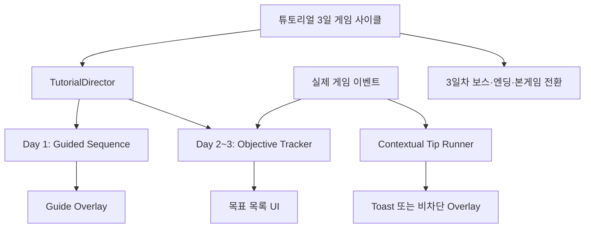

# 튜토리얼 재구성 구조 검토 및 AI 인수인계

> 작성일: 2026-08-09 (결정 반영: 2026-08-09 · **구현 반영: 2026-08-10 → §0-A**)  
> 목적: 현재 구현된 튜토리얼과 노션 재구성 설계안을 함께 검토한 결과를 기록하고, 이후 작업을 맡는 팀원·AI가 같은 전제에서 설계와 구현을 이어갈 수 있게 한다.  
> 문서 성격: 확정 기획서가 아닌 **구조 검토 및 구현 방향 제안**이다. 상세 게임 기획의 기준은 [`기획종합_v2.md`](기획종합_v2.md)이며, `[미정]` 항목을 이 문서로 확정하지 않는다.

## 0-A. 구현 현황 (2026-08-10)

§11 우선순위의 **1~4번이 구현됐다.** 팁 러너와 문구 재분류(5~8번)는 아직이다.

| 항목 | 상태 | 결과물 |
|---|---|---|
| Day1 시퀀스 축소 | 완료 | `TS_Day1CoreSequence` (57 → 12단계). 기존 스텝 에셋을 재사용해 조립했고 `TS_Day1Sequence`는 그대로 남겨 뒀다 |
| 챕터 9개 → 1개 | 완료 | `Chapter_Day1_Build`만 목록에 남기고 나머지 8개는 **비활성 보존**(문구 재분류에 필요) |
| 게이트 해제 | 완료·검증 | 러너가 꺼지면 4개 게이트가 전부 자동 해제된다(아래 참조) |
| 목표 추적기 | 완료 | `TutorialObjectiveController` + `TutorialObjectiveSO` + `TutorialTriggerSpec` |
| 목표 패널 | 완료 | `UI_TutorialObjectiveWindow` / `UI_TutorialObjectiveSlot` (§0 결정 뒤집힘 — §6 참조) |
| 새끼용 강제 | 완료 | 기존 `BabyDragonGuideController`로 대체. `TS_Day2BabyDragonSequence`(27단계) 챕터는 폐기 |
| 맥락 팁 러너 | **미구현** | §7·§11-5. 다음 단계 |
| 문구 재분류 | **미구현** | §11-7 |

### 설계와 달라진 두 가지

- **`TutorialDirector`를 만들지 않았다.** §4는 새 컴포넌트를 제안했지만, `TutorialScenarioController`의
  챕터 목록을 1개로 줄이면 마지막 챕터가 끝날 때 그대로 멈춘다. 새 오케스트레이터가 필요 없었다.
- **게이트 해제가 구조적으로 보장된다.** 4개 게이트(`CycleManager.DayEndBlockQuery`,
  `UIManager.OpenQuery`, `MinimapController.BlockQuery`, `UI_SpeedSettingWindow.BlockQuery`)는 모두
  단일 슬롯 프로퍼티이고, `TutorialRunner`가 `OnDisable`에서 자기가 건 것만 되돌린다. 러너가 하나뿐이면
  그 러너가 꺼지는 순간 전부 풀린다 — §12의 해당 검증 항목은 이제 회귀 확인용이다.

### 완주 검증에서 드러난 것 (2026-08-10)

3일 완주를 돌려 보고 나서야 잡힌 것들이다. **셋 다 "조용히 아무 일도 일어나지 않는" 형태**라
코드를 읽는 것만으로는 보이지 않았다.

| 증상 | 원인 | 조치 |
|---|---|---|
| 알이 지급·부화되는데 **새끼용 안내가 하나도 안 뜬다** | `Tutorial.unity`에서 `BabyDragonGuideController`와 `ProgressionNotificationPresenter`의 **컴포넌트 체크박스가 꺼져 있었다.** 27단계 챕터가 가르치던 시절의 설정이다 | 씬에서 둘 다 켰다 |
| 켜고 나니 **첫 안내(인벤토리를 열어라)를 건너뛴다** | `UI_DragonWindow.Awake`가 탭 시각 상태를 맞추려고 `SelectTab`을 부르고, 그것이 `OnTabDisplayed`를 발화한다. 창은 아직 열리지도 않았는데 `HandleTabDisplayed`가 인자를 무시하고 `WaitHatch`로 전진시켰다 | `HandleTabDisplayed`가 **창이 열려 있을 때만** 전진하도록 고쳤다 |
| 고친 뒤 **창을 열어도 아무 반응이 없고 갇힌다** | 위 수정을 "새끼용 탭이 보일 때만"으로 너무 좁게 걸었다. 창은 마지막에 보던 탭(기본 어미용)으로 열리므로 조건이 성립하지 않았고, `OpenInventory`는 입력을 차단한 채 HUD 버튼만 가리켜 손쓸 방법이 없었다 | 판정 기준을 탭 종류가 아니라 **창 열림**으로 바꿨다. 탭 이동 유도는 원래대로 `WaitHatch`의 `ShowSlotGuide`가 맡는다 |
| 타워 안내가 끝나도 **타워 정보 창이 열린 채로 남고**, 그 위에 알 토스트와 새끼용 안내가 겹친다 | Day1을 줄이면서 `TS_045_ClosePanel`(인구 창 닫기)까지 같이 빠졌다 | 그 단계를 되살려 Day1을 **12단계**로 했다 |
| `mother_dragon_checked` 목표가 **게임 시작 즉시 완료**된다 | 위와 같은 뿌리. 어미용이 기본 탭이라 `Awake`의 발화 한 번으로 조건이 성립했다 | `IsMotherTabShown`까지 확인하도록 고쳤다 |

교훈은 하나다 — **`UI_DragonWindow.OnTabDisplayed`는 "사용자가 탭을 눌렀다"가 아니라 "탭이 그려졌다"이다.**
이 이벤트를 새로 구독하는 쪽은 창이 열려 있는지(`IsBabyTabShown`/`IsMotherTabShown`)를 반드시 함께 봐야 한다.

폐기한 챕터가 켜 두던 설정에 기대던 것이 또 있을 수 있다. 챕터를 뺄 때는 그 챕터 오브젝트만이 아니라
**그 챕터가 있었기에 꺼 두었던 상시 컴포넌트**도 함께 확인해야 한다.

### 완주 결과 (2026-08-10)

Day1 강제 12단계 → 새끼용 4단계 → 3일 낮/밤 → 보스 → 엔딩 → `SampleScene`까지 한 번에 통과했다.

| 확인 항목 | 결과 |
|---|---|
| Day1 강제 단계 | 12개, 전부 통과 |
| 게이트 해제 | 러너 종료와 동시에 4개 모두 해제(밤 진입·창 열기·미니맵·속도) |
| 새끼용 4단계 | `[OpenInventory, WaitHatch, PlaceDragon, Completed]` 전부 기록, 새끼용 1마리 배치 |
| 안내 하이라이트 이동 | `Button_Dragon` → `Button_BabyDragon` → `Slot_Egg_List` → (부화 후) `Button_Dragon` → 배치 |
| 부화 타이밍 | **Day3 아침**. `DaysToHatch=2` + `_initialFedDayCount=1`이면 Day2 아침에 1→2가 아니라 Day3에 도달한다 |
| 목표 패널 | Day2에 2줄 → Day3에 5줄. 미완료가 이월된다 |
| 딤 겹침 | `_overlayRoot`(형제 0) < 목표 패널(형제 2) — 패널이 위에 그려진다 |
| 마지막 밤 | 강제 패배 로그 없이 실제 전투로 성이 무너지고 엔딩 재생 |
| 본게임 핸드오프 | `SampleScene` 전환 후 튜토리얼 진행도가 **전부 0** — 오염 없음 |

**밤 난이도 참고:** 타워 1개로 1일차 밤을 넘기면 성이 100 → 25로 떨어지고
`TutorialCastleGuard`의 25% 구제가 실제로 발동한다. 3일차 시작 시 성은 20이었다.
구제가 예외가 아니라 정상 경로에 가까우므로 §11-8에서 함께 본다.

**아직 확인되지 않은 것:** 위 완주는 마우스 입력이 아니라 같은 코드 경로를 스크립트로 호출한 것이다
(버튼은 `onClick.Invoke`, 그리드는 `TryConstructAt`). InputSystem·레이캐스트 계층은 지나지 않으므로
"딤이 실제로 클릭을 막는가", "버튼이 손으로 눌리는가"는 여전히 사람 손으로 확인해야 한다.

### 연구 점수 지급이 챕터에서 분리됐다

`TutorialResearchPointGrant`는 연구 챕터 오브젝트에 붙어 `OnEnable`에 지급하고 있었다. 챕터를 빼면
지급도 함께 사라져 **"연구 하나 완료" 목표가 달성 불가능해진다**(연구소 정원 2명 × 5점/일, 1티어 노드 10점).
상시 오브젝트로 옮기고 `CycleManager.OnDayStart`로 지정 일차(기본 2일차)에 1회 지급하도록 바꿨다.
상시 오브젝트에서 `OnEnable`로 지급하면 연구를 배우기도 전인 1일차에 점수가 생기므로 날짜를 직접 기다린다.

## 0. 확정된 결정 (노션 설계안과의 쟁점 정리)

노션 [재구성 설계안](https://app.notion.com/p/3b59e55d7974812c9bf0de98debc2fc9)과 본 검토서가 갈렸던 네 지점은
아래와 같이 확정됐다. 이후 절의 서술은 이 결정을 따르며, 결정과 어긋나던 초안 권고는 수정했다.

| 쟁점 | 확정 | 근거 |
|---|---|---|
| 팁 시스템 범위 | **본게임(`SampleScene`) 재사용 가능하게 설계** | 알파 후 본게임 팁으로 확장 예정. 지금 튜토리얼 전용으로 묶으면 그때 다시 만들게 된다 |
| 새끼용 배치 | **강제 유지** (노션 안 채택) — 구현은 기존 `BabyDragonGuideController` | 본 검토서의 "스킵 가능 미니 가이드" 권고는 **철회**. 결정은 그대로지만 **새 강제 시퀀스를 만들지 않고** 이미 있던 4단계 가이드를 쓴다 (2026-08-10, §5) |
| 진행 기록 방식 | **본 검토서 §9 안 채택** | `TryEnterTutorialStep` 공유는 팁 영구 누락 버그를 만든다 |
| 목표 목록 UI | ~~신규 UI 제작 없음~~ → **상시 패널을 만든다** | **2026-08-10 뒤집힘.** "목록을 항상 볼 수 없다"는 §6의 전제가 함께 무너진다 (§6) |

미해결로 남은 것은 아래 세 가지다. (새끼용 시작 시점은 2026-08-10에 해소됐다 — §5)

- **본게임 확장 시점의 프리팹 제약** — 노션 "안 하는 것"은 `SampleScene`·`UI_Canvas` 프리팹 수정을
  금지하고 배치 위치를 `Tutorial.unity`로 한정한다. 팁을 본게임까지 확장할 때 이 제약을 어떻게 풀지는
  알파 후에 정한다. 지금은 **컴포넌트를 씬·도메인에 묶지 않는 것**까지만 지키고, 실제 배치는
  `Tutorial.unity`에만 둔다. (§7)
- **목표별 도움말 진입점** — `HelpTipId`/`HelpAnchor`는 누를 자리가 없어져 보류했었다. 목록 패널이
  생기면서 누를 자리는 생겼지만 아직 넣지 않았다. 팁 러너와 함께 정한다. (§8)
- **새끼용 부화 타이밍 수치** — 실측상 부화는 **Day3 아침**이라 배치 안내가 마지막 날에야 뜬다.
  Day2로 당기려면 `BabyDragonTutorialHandOff._initialFedDayCount`(현재 1)나
  `BabyDragonData._daysToHatch`(현재 2)를 조정해야 한다. 밸런스 판단이므로 팀에서 정한다. (§5)

`목표 상기 커버리지 부족 시의 대안`은 상시 패널이 생기면서 사라졌다 — 목표를 언제든 볼 수 있으므로
기존 창에 텍스트를 얹을지 고민할 필요가 없다.

## 1. 검토 대상

### 저장소

- 사용자가 알려 준 커밋은 `770844d`였으나 저장소에는 해당 객체가 없다.
- 문맥상 대응하는 완료 커밋은 `720844d` (`튜토리얼 완료 - 미세 수정 필요`)이다.
- `720844d` 이후 현재 `HEAD`까지 튜토리얼의 실질적인 변경은 `Tutorial.unity` UI 좌표의 미세한 부동소수점 차이 정도다. 따라서 현재 구조는 사실상 해당 완료본과 같다.
- 검토 시 작업 트리에 사용자 변경이 있었으므로 본 문서 외 기존 파일은 수정하지 않는다.

주요 구현 파일:

- [`Assets/Scripts/Tutorial/TutorialRunner.cs`](../Assets/Scripts/Tutorial/TutorialRunner.cs)
- [`Assets/Scripts/Tutorial/TutorialScenarioController.cs`](../Assets/Scripts/Tutorial/TutorialScenarioController.cs)
- [`Assets/Scripts/Tutorial/TutorialDayLoopController.cs`](../Assets/Scripts/Tutorial/TutorialDayLoopController.cs)
- [`Assets/Scripts/Tutorial/TutorialCastleGuard.cs`](../Assets/Scripts/Tutorial/TutorialCastleGuard.cs)
- [`Assets/Scripts/Tutorial/TutorialBossDefeatController.cs`](../Assets/Scripts/Tutorial/TutorialBossDefeatController.cs)
- [`Assets/Scripts/UI/Guide/UI_GuideOverlay.cs`](../Assets/Scripts/UI/Guide/UI_GuideOverlay.cs)
- [`Assets/Scripts/Managers/RunData.cs`](../Assets/Scripts/Managers/RunData.cs)
- [`Assets/Prefabs/Tutorial System.prefab`](../Assets/Prefabs/Tutorial%20System.prefab)
- [`Assets/Data/Tutorial/`](../Assets/Data/Tutorial/)

### 노션

- 상위 설계: [3일 분리형 튜토리얼 모드 — 설계안 (260806)](https://app.notion.com/p/3b39e55d797481699f2ce925b802e6be)
- 재구성 설계: [튜토리얼 재구성 설계안 (260807) — 지시에서 목표로](https://app.notion.com/p/3b59e55d7974812c9bf0de98debc2fc9)

상위 설계의 핵심은 독립 `Tutorial.unity`에서 3일짜리 축소 게임을 진행하고, 마지막 밤 보스 패배와 엔딩을 거쳐 본게임으로 전환하는 것이다. 재구성 설계는 이 틀을 유지하면서 교육 방식을 긴 선형 지시에서 자유 목표와 맥락 팁으로 바꾸려는 안이다.

## 2. 현재 구현 요약

현재 `Tutorial System.prefab`에는 다음과 같이 9개 챕터가 직렬로 연결되어 있다.

1. Day1 Build
2. Day1 BabyDragon
3. Day2 Settlement
4. Day2 Research
5. Day2 MainDragon
6. Day2 BabyDragon
7. Day2 SlimeFarm
8. Day2 WorkerMode
9. Day3 Warning

`TutorialScenarioController`는 현재 챕터 하나가 끝나면 다음 챕터 하나를 여는 선형 오케스트레이터다. 각 챕터는 `TutorialRunner` 하나와 `TutorialSequenceSO` 하나를 가진다.

현재 에셋 참조를 기준으로 집계하면:

| 항목 | 현재 값 |
|---|---:|
| 전체 단계 | 135 |
| 설명형(`Acknowledge`) | 69 |
| 입력 차단 단계 | 110 |
| 첫 밤 전 단계 | 65 |

노션에는 설명형 68개, 입력 차단 109개로 기록되어 있어 각각 한 단계 차이가 있지만 전체 진단에는 영향이 없다.

`TutorialRunner`는 실행 중 다음을 모두 통제한다.

- `IDayEndBlockQuery`: 튜토리얼이 끝날 때까지 밤 진입 차단
- `IHudControlBlockQuery`: 속도·미니맵 등 HUD 조작 차단
- `IExclusiveModeOpenQuery`: 아직 안내하지 않은 창 열기 차단
- 각 단계의 `blocksInput`: 강조 대상 외 입력 차단

따라서 현재 구조의 지루함은 주로 텍스트 양이 아니라 **플레이어가 긴 시간 동안 정해진 순서 외의 행동을 할 수 없는 것**에서 발생한다.

## 3. 유지해야 할 것과 교체해야 할 것

### 유지 권장

상위 설계에서 구현한 다음 영역은 목적과 책임이 명확하므로 유지하는 편이 좋다.

- 본게임과 분리된 `Tutorial.unity`
- 세이브 시스템과 분리된 독립 런
- 3일 낮/밤 루프
- 1·2일차 실제 웨이브
- 튜토리얼 중 조기 게임오버를 막는 `TutorialCastleGuard` — **1~2일차에만** 적용된다
- 3일차 보스 전투 — **연출된 패배가 아니라 실제 전투다** (2026-08-10 변경, 아래)
- 엔딩 컷씬
- `SampleScene`으로의 핸드오프

#### 마지막 밤은 실제 전투다 (2026-08-10 변경)

`TutorialBossDefeatController`는 보스가 성 앞에 닿기를 기다렸다가 시간이 지나면 성을 강제로 부쉈다.
그 장치를 전부 없앴다 — **보스 웨이브 데이터 자체가 플레이어가 이길 수 없게 설계돼 있어**
연출을 위해 결과를 조작할 이유가 없다. 강제 패배는 "막아 봤지만 뚫렸다"를 "갑자기 성이 사라졌다"로
만들 위험만 남긴다.

이제 마지막 밤에 하는 일은 둘뿐이다.

1. `TutorialCastleGuard.AllowDefeat()` — 치명타 거절과 25% 구제를 한꺼번에 푼다
2. 보스 웨이브 시작

`SuspendRescue()`는 `AllowDefeat()` 하나로 대체되어 삭제했다. 잡몹이 보스보다 먼저 성을 부수는 것도
막지 않는다 — 그것도 이 밤의 정직한 결과다.

`AllMonstersDefeated` 구독은 **진단용으로만** 남겼다. 결과를 뒤집지 않고, "이길 수 없어야 할 웨이브를
막아냈다"는 `LogError`만 낸다. 보스 데이터를 손볼 때 이 전제가 조용히 깨지는 것을 잡기 위해서다
(전제가 깨지면 튜토리얼에 없는 4일차로 넘어간다).

### 교체 권장

교체 대상은 3일 사이클이 아니라 그 위에 얹힌 교육 방식이다.

- 9개 챕터·135단계 직렬 진행
- Day2~3에도 계속 활성화되는 전역 입력 관문
- 설명을 위해 확인 버튼을 반복해서 누르는 흐름
- 한 기능을 여러 단계로 잘게 나누어 반드시 순서대로 수행하게 하는 방식

## 4. 권장 아키텍처



### 책임 분리

#### ~~`TutorialDirector`~~ → 만들지 않았다 (2026-08-10)

초안은 아래 역할의 새 컴포넌트를 제안했다.

- 현재 날짜와 교육 모드만 전환한다.
- Day1에는 강제 시퀀스를 활성화한다.
- 첫 밤 종료 후 강제 시퀀스를 완전히 종료하고 모든 관문을 해제한다.
- Day2~3에는 목표 추적기와 맥락 팁만 활성화한다.

**실제로는 필요하지 않았다.** `TutorialScenarioController`의 챕터 목록을 Day1 하나로 줄이면
그 챕터가 끝날 때 `EnterChapter(1)`이 범위를 벗어나 그대로 멈춘다. 관문 해제도 러너의 `OnDisable`이
알아서 한다(§0-A). 목표 추적기와 팁은 애초에 챕터와 무관한 상시 컴포넌트라 "활성화"해 줄 주체가 없다.

#### `TutorialRunner`

- 범용 튜토리얼 엔진으로 계속 확장하지 않는다.
- 첫날의 짧은 조작 문법 학습에만 사용한다.
- 실행 중 전역 관문을 거는 기존 특성상 Day2~3 자유 목표에는 사용하지 않는다.

#### `TutorialObjectiveController`

- 여러 목표를 동시에 활성화하고 독립적으로 완료 처리한다.
- 목표에 `RecommendedDay`를 둘 수 있지만, 밤이 지나도 미완료 목표는 유지한다.
- 실제 게임 이벤트를 튜토리얼 시작 시점부터 구독해 이미 수행한 행동을 놓치지 않게 한다.
- 밤 진입을 막지 않는다.
- 새끼용 배치는 이 추적기가 아니라 Day2의 짧은 강제 시퀀스가 담당한다(§0 확정). 목표 목록에
  섞지 않는다 — 자유 목표와 강제 항목이 한 목록에 있으면 규칙이 흐려진다.

#### `ContextualTipRunner`

- 실제 행동이 일어났을 때 관련 설명을 한 번만 보여준다.
- 동시에 여러 팁이 발생하면 큐에 넣고 순서대로 표시한다.
- 오버레이 표시권을 얻지 못한 팁은 폐기하지 않고 `DisplayReleased` 이후 다시 시도한다.
- 팁을 실제로 표시한 다음에만 “표시 완료”로 기록한다.
- 튜토리얼 컴포넌트를 참조하지 않는다 — 본게임 재사용 조건이다. 상세는 §7.

## 5. 권장 플레이 흐름

### Day 1 — 핵심 문법만 강제

목표는 “타워를 건설하고 인구를 배치해 첫 밤을 버틴다” 하나다.

권장 단계는 약 9개다.

1. 짧은 상황 소개
2. 건설 모드 열기
3. 타워 탭 선택
4. 타워 선택
5. 타워 배치
6. 설치한 타워 선택
7. 인구 배치
8. 인구가 있어야 타워가 작동한다는 결과 안내
9. 밤 시작

연구소, 생산시설, 철거, 일꾼 모드, 점령, 상세 자원 규칙은 첫날 강제 시퀀스에서 제외한다.

### Day 2 — 자유 목표

- 농장 건설
- 연구 하나 완료
- 새끼용 배치 — **강제 (예외)**

농장·연구는 동시에 보이고 순서와 타이밍은 자유로 둔다.

**새끼용 배치는 강제 시퀀스로 유지한다**(§0 확정). Day2에서 유일하게 순서를 강제하는 항목이므로,
Day2~3 자유 원칙의 예외임을 데이터와 코드 양쪽에서 드러나게 둔다 — 목표 목록에 섞어 놓으면
“자유 목표인데 왜 건너뛸 수 없는가”가 된다.

#### 구현과 시작 시점 (2026-08-10 확정)

**새 강제 시퀀스를 만들지 않고 이미 있던 `BabyDragonGuideController`를 쓴다.** 이 컴포넌트는
획득 → 인벤토리 → 부화 → 배치 4단계를 단조 전진으로 유도하며, 전역 관문을 걸지 않고
`OpenInventory` 한 단계만 입력을 막는다(버튼 한 번이면 끝나는 행동이라 갇히지 않는다).
진행도는 `RunData.EnteredGuideSteps`에 남고, 1일차 안내가 화면을 쓰는 동안에는 표시권을 양보했다가
`DisplayReleased` 때 그 시점의 단계부터 다시 유도한다. `TS_Day2BabyDragonSequence`(27단계) 챕터는 폐기했다.

시작 시점은 **첫 알 부화 시점** 쪽으로 정해졌고, 코드를 고치지 않고도 그렇게 된다.
`BabyDragonTutorialHandOff`가 `TutorialRunner.TutorialEnded`에 알 지급을 걸어 두었으므로
Day1 낮 끝 → 알 지급 → 인벤토리 안내 → 밤 → 부화 → 배치 안내 순서가 된다.
알 지급을 튜토리얼 종료로 미루면 완주와 건너뛰기가 같은 경로가 되는 이점도 그대로다.

**실측 결과 부화는 Day3 아침이다.** `BabyDragonData._daysToHatch`가 5속성 모두 2이고
`_initialFedDayCount`가 1인데, 성장은 `OnDayStart`마다 1씩 오르므로 Day2 아침에 2에 닿지 않고
Day3 아침에 부화한다. 배치 안내가 마지막 날에야 뜨는 셈이라, Day2에 부화시키려면
`_initialFedDayCount`를 올리거나 `_daysToHatch`를 조정해야 한다 — 어느 쪽이든 밸런스 판단이다.

### Day 3 — 확장 목표

- 점령 파병
- 슬라임 농장 건설
- 어미용 속성 확인

Day2 미완료 목표가 있으면 Day3에도 함께 남긴다. 마지막 밤에도 목표 미완료를 이유로 진행을 차단하지 않는다.

## 6. 목표와 밤 진입 규칙

“밤 진입을 막지 않는다”와 “그날 목표를 반드시 완료한다”는 동시에 만족시킬 수 없다. 따라서 목표는 필수 관문이 아니라 권장 학습 항목으로 취급한다.

- 알림과 관계없이 밤은 정상적으로 시작한다. (상기 시점은 아래 목표 UI 절에 모아 두었다)
- 미완료 목표는 다음 날로 이월한다.
- 이후 진행에 반드시 필요한 조작은 자유 목표로 두지 않고 **강제 시퀀스**에 넣는다.
  원칙은 Day1 핵심 시퀀스지만, **새끼용 배치는 Day2의 강제 시퀀스로 두는 것이 확정**됐다(§0).
  Day1에 넣지 않는 이유는 첫날 목표를 "타워 건설 + 인구 배치로 첫 밤 버티기" 하나로 유지해야 하고,
  알이 아직 없는 시점이라 가리킬 대상 자체가 없기 때문이다.
  즉 강제 항목은 Day1에만 있다는 뜻이 아니라, **자유 목표 목록에 섞이지 않는다**는 뜻이다.

### 목표 UI — 상시 패널 (2026-08-10 방향 전환)

> 이 절의 초안은 "신규 UI를 만들지 않는다"였고, 쓸 수 있는 기존 자산이 둘 다 일시 표시형
> (`UI_NotificationToast`는 페이드 후 소멸, `UI_GuideOverlay` 말풍선은 표시권 경쟁 + 강한 딤)이라
> **상시 목록을 포기하고 상기 시점 3개로 대신한다**는 결론이었다. "표시 수단이 설계를 결정한다"는
> 논증이었는데, 패널을 만들기로 하면서 그 전제가 사라져 결론도 함께 풀렸다.

**상시 패널을 만든다.** 구현은 점령 목록(`UI_ClaimListWindow` + `UI_ClaimListSlot`)의
`ComponentPool` 패턴을 그대로 본떴다 — 새 풀링 코드를 쓰지 않는다.

| 컴포넌트 | 역할 |
|---|---|
| `UI_TutorialObjectiveWindow` | `TutorialObjectiveController.ObjectivesChanged`를 구독해 전체를 다시 그린다 |
| `UI_TutorialObjectiveSlot` | 한 줄. 문구 + 완료 체크 |

배치와 수명에서 지켜야 할 것이 넷 있다.

- **`TutorialGuide_overlay.prefab` 안에 둔다.** 이 프리팹은 `Tutorial.unity`에서만 인스턴스화되므로
  팀 공유 자산인 `UI_Canvas.prefab`을 건드리지 않는다 — §0의 "합의 필요" 문제가 사라진다.
- **`UI_GuideOverlay._overlayRoot`보다 뒤 형제**여야 한다. 오버레이는 딤 패널을 런타임에 `_overlayRoot`
  아래로 만들고 대상이 없을 때 화면 전체를 덮는다. 앞 형제에 두면 하필 새끼용 안내가 뜨는 2일차에
  목록이 딤에 가려진다.
- **씬에 비활성으로 저장하고 Day1 러너 종료 시 켠다.** `Awake`에서 자기를 닫지 않으므로 CLAUDE.md의
  `_isOpen` 가드는 필요 없다 — 다만 나중에 토글 버튼을 붙이면 그때는 가드가 **필수**다.
- **`OnEnable`에서 구독한 직후 현재 목표를 1회 수동으로 그린다.** 이 창은 1일차가 끝난 뒤에 켜지므로
  그전에 완료된 목표가 있을 수 있고, 그러면 기다릴 이벤트가 없어 빈 목록으로 열린다.

상기 시점은 셋에서 **둘로 줄었다.** 목록이 항상 화면에 있으므로 "날짜 시작 시 1회 안내"는 필요 없다.

- ~~날짜 시작 시~~ — 패널이 상시 표시하므로 불필요
- 밤 버튼을 누를 때 — 미완료 목표 수를 1회 상기 (`CycleManager.OnDayEnd`)
- 목표 완료 시 — 완료를 1회 알림

초안이 적어 둔 **한계("원할 때 다시 열어 볼 방법이 없다")는 해소됐다.** 이 교환 덕에 패널 제작이
순증 작업은 아니다 — 안내 시점 하나와 맞바꾼 셈이다.

## 7. 팁 표시 정책

모든 팁을 `UI_GuideOverlay`로 표시하지 않는다.

| 정보 종류 | 권장 표시 방식 |
|---|---|
| 버튼·탭 등 위치를 알아야 하는 안내 | 비차단 `UI_GuideOverlay` |
| 환급, 식량, 지형별 생산 등 규칙 설명 | `UI_NotificationToast` |
| 목표 완료 | 목표 패널 체크 표시 |
| 현재 행동을 중단하고 반드시 읽어야 하는 정보 | 매우 제한적으로 확인형 오버레이 |

`UI_GuideOverlay`는 입력 차단을 끄더라도 대상을 조명하고 주변을 어둡게 만드는 강한 연출이다. 자유 플레이 중 팁마다 사용하면 또 다른 형태의 방해가 된다.

4초 고정 표시는 문구 길이에 따라 너무 짧을 수 있다. 다음 중 하나를 권장한다.

- 문구 길이에 따라 4~8초 범위 사용
- 관련 창을 닫을 때까지 유지하되 입력은 차단하지 않음
- 토스트는 중복 방지를 적용 — **큐는 `UI_NotificationToast`에 이미 구현되어 있다**(`_pendingMessages`)

### 본게임 재사용을 막지 않는 설계 (§0 확정)

팁은 알파 이후 `SampleScene`에서도 쓸 예정이므로, 지금 튜토리얼에 묶어 만들면 그때 다시 만들게 된다.
**배치는 `Tutorial.unity`에만 두되, 컴포넌트는 씬과 도메인에 의존하지 않게** 짠다.

- `ContextualTipRunner`는 `TutorialRunner`·`TutorialDirector`·챕터 진행도를 참조하지 않는다.
  구독 대상은 튜토리얼 상태가 아니라 **실제 게임 이벤트**뿐이다.
- "이미 보여준 팁" 저장소를 러너가 직접 `RunData`로 지목하지 않는다. 튜토리얼은 `RunData`,
  본게임은 다른 저장소가 될 수 있으므로 **인터페이스 하나를 사이에 둔다**(예: `ITipHistory`).
  §9의 필드 분리는 그 인터페이스의 튜토리얼 구현으로 본다.
- `ContextualTipSO`에 튜토리얼 전용 개념(챕터·단계 번호·`RecommendedDay`)을 넣지 않는다.
  팁이 아는 것은 트리거·문구·앵커·표시 방식까지다.
- 이미 도메인을 모르게 짜여 있는 `UI_NotificationToast`·`UI_GuideOverlay`·`GuideAnchorRegistry`는
  그대로 쓴다 — 이들은 재사용 조건을 이미 만족한다.

반대로 **지금 하지 않을 것**은 노션 안과 같다. 본게임 팁 데이터 작성과 `SampleScene` 배선은 알파 후다.
여기서 지키는 것은 "그때 러너를 뜯어고칠 필요가 없게 해 두는 것"까지다.

## 8. 데이터 구조 제안

### 공통 트리거

`TutorialConditionType`의 이벤트 훅은 재사용할 수 있지만 `TutorialStepSO` 전체를 목표·팁에 재사용하지 않는다. 목표와 팁이 공유할 조건 데이터는 별도로 둔다.

```text
TutorialTriggerSpec          (2026-08-10 구현됨)
- Condition
- TargetMode
- TargetBuilding
- TargetFactoryData
- RequiredAmount             ← 넣지 않았다. 지금 목표 다섯 중 수량을 세는 것이 없다
```

건물·창 종류 판정은 `TutorialRunner`에만 있던 `MatchesBuilding`/`MatchesMode`를
**`TutorialTargetMatcher`로 추출해 양쪽이 같은 것을 쓴다.** 복제하면 한쪽만 고쳐져 갈라진다.
러너는 호출부를 그대로 둔 채 위임만 한다.

슬라임 농장을 일반 농장과 구분해야 해서 `TutorialBuildingKind`에 `SlimeFactory`를 **끝에** 추가했다
(정수로 저장되므로 중간 삽입 금지). `Factory` 쪽은 좁히지 않았다 — 기존 단계 에셋의 판정을 바꾸지 않기 위해서다.

### 목표 데이터

```text
TutorialObjectiveSO
- ObjectiveId
- TitleLocKey
- DescriptionLocKey
- RecommendedDay
- CompletionTrigger
```

`HelpTipId`/`HelpAnchor`는 초안에 있었으나 뺐다. 목표 목록에서 "도움말"을 누르는 방식이
전제였는데, 신규 UI를 만들지 않기로 하면서 누를 자리가 없어졌기 때문이다.
**2026-08-10에 패널이 생기면서 그 전제는 되살아났지만 아직 넣지 않았다** — 팁 러너와 함께 정한다.

목표 완료 기록은 §9대로 `RunData.CompletedTutorialObjectiveIds`에 남긴다.
`EnteredTutorialStepIds`를 재사용하지 않는다 — 저쪽은 "진입", 이쪽은 "완료"라 의미가 다르다.

### 팁 데이터

```text
ContextualTipSO
- TipId
- Trigger
- MessageLocKey
- PresentationKind (Toast / Overlay)
- Anchor
- Duration
- Priority
```

## 9. 진행 기록 주의사항 (§0 확정 — 이 절의 안을 채택)

현재 `RunData.TryEnterTutorialStep()`은 “완료”나 “표시 성공”이 아니라 **해당 선형 단계에 진입함**을 기록한다. 이를 팁과 목표에 그대로 공유하면 의미가 섞인다.

권장 필드:

```text
CompletedTutorialObjectiveIds
ShownTutorialTipIds
```

팁 ID는 `UI_GuideOverlay.Show()`가 성공한 뒤 기록한다. 더 높은 우선순위 안내가 표시권을 가지고 있어 `Show()`가 실패했는데 먼저 기록하면, 플레이어에게 보이지 않은 팁이 영구히 누락된다.

튜토리얼은 한 씬의 한 런 안에서 끝나므로 노션 재구성안대로 `RunData`에 저장하고 `PlayerPrefs`는 사용하지 않는다.

두 필드의 취급은 다르다. **인터페이스 뒤로 보내는 것은 팁 이력뿐이다.**

- `ShownTutorialTipIds` — 팁은 본게임에서도 쓰므로 러너가 `RunData`를 직접 지목하지 않는다.
  §7의 재사용 조건대로 저장소를 인터페이스 뒤에 두고, 이 필드를 그 튜토리얼 구현으로 삼는다.
- `CompletedTutorialObjectiveIds` — 목표는 튜토리얼에만 있는 개념이다. `SampleScene`에는 대응물이
  없으므로 추상화하지 않고 `RunData`를 그대로 쓴다.

## 10. “밤이 가르친다”를 실제 경험으로 만드는 법

이 원칙은 게임의 핵심 컨셉인 “낮의 선택이 밤의 생존을 결정한다”와 잘 맞는다. 다만 밤의 결과가 아무 정보도 주지 않으면 플레이어는 다음 날 무엇을 바꿔야 하는지 알 수 없다.

현재 `TutorialCastleGuard`는 성이 위태로워지면 남은 웨이브를 정리해 튜토리얼이 중간 종료되지 않도록 한다. 이 안전장치는 유지하되 다음 날 결과를 짧게 연결한다.

- 성 피해가 컸다 → 타워 위치 또는 방어 인구 보강 힌트
- 식량이 부족하다 → 농장 목표 강조
- 연구 포인트를 얻었다 → 연구 목표 강조
- 점령을 보내지 않았다 → 다음 확장 목표를 자연스럽게 노출

즉, 낮에 모든 규칙을 미리 읽히는 대신 밤 결과가 다음 학습 목표의 이유가 되게 한다.

## 11. 구현 우선순위 제안

1. ~~기존 3일 루프·보스·엔딩·본게임 핸드오프 회귀 보호~~ ✅
2. ~~Day1 시퀀스를 약 9단계로 축소~~ ✅ (12단계로 조립 — `TS_Day1CoreSequence`)
3. ~~첫 밤 종료 후 `TutorialRunner`와 모든 입력 관문이 확실히 해제되는지 검증~~ ✅
4. ~~Day2~3 병렬 목표 추적 구현~~ ✅ (새끼용은 `BabyDragonGuideController`가 담당)
5. 팁 중복 방지·표시 성공 후 기록 구현 — 저장소는 인터페이스 뒤에 둔다 ⬜
6. ~~목표 상기 시점을 토스트에 연결~~ ✅ — 3곳이 아니라 **2곳**이다(§6). 패널은 신규 제작했다
7. 기존 문구를 강제 단계, 팁, 미사용 후보로 분류 ⬜
   - **실측 기준(2026-08-10):** `Assets/StreamingAssets/Localization/ko_kr.csv`의 `tutorial_` 키는
     **150개**(ko/en 동수). 그중 7개가 이번에 추가한 `tutorial_objective_` 계열이므로
     분류 대상은 **143개**다. `Docs/로컬라이징_튜토리얼_ko_kr.csv`는 141개로 뒤처져 있다 —
     문서 사본이 최신이 아니니 StreamingAssets를 기준으로 삼는다.
     노션의 "137개"도, 본 문서 초안의 "135개"도 실제 값이 아니다 — 135는 **단계** 수였다.
     Day1 시퀀스가 12단계로 줄면서 지금은 **대부분의 키가 어느 단계에도 붙어 있지 않다.**
     분류 작업의 첫 단계는 폐기된 8개 챕터의 시퀀스를 훑어 키 → 단계 매핑을 만드는 것이다
     (그래서 챕터 오브젝트를 지우지 않고 비활성으로 남겼다).
8. 플레이테스트 후 밤 웨이브와 피드백 문구 조정 ⬜
   - Day1이 타워 1개로 첫 밤을 맞는다. `TutorialCastleGuard`의 25% 구제가 예외가 아니라
     정상 경로가 될 수 있으니 1일차 웨이브 강도를 함께 본다.

## 12. 검증 기준

- 첫 밤까지 강제 단계가 9~10개 이내인가?
- 첫 밤 이후 `CanEndDay`, HUD, 창 열기 관문이 모두 해제되는가?
- Day2 목표를 어떤 순서로 수행해도 완료되는가?
- **다섯 목표가 실제로 달성 가능한 자원·연구 범위 안에 있는가?** 순서 무관 통과만 봐서는
  "아예 못 하는 목표"를 걸러내지 못한다. 특히 연구 목표는 §0-A의 지급이 도는지에 달려 있다.
- **완료되지 않아야 할 때 완료되지 않는가, 그리고 완료되어야 할 때 완료되는가?** 양쪽을 다 봐야 한다.
  실제로 `mother_dragon_checked`가 시작 즉시 완료되는 버그가 있었다 — 용 창은 닫힌 채 목록을 다시
  그릴 때도 `OnTabDisplayed(false)`를 발화하고 어미용이 기본 탭이라, 초기화 한 번으로 조건이 성립했다.
  `IsMotherTabShown`까지 확인해 고쳤다.
- 목표를 먼저 수행한 뒤 관련 안내가 활성화되어도 완료 상태를 복구할 수 있는가?
- 동시에 발생한 팁이 누락되거나 겹치지 않는가?
- 표시권 경쟁에서 밀린 팁이 폐기되지 않고 나중에 다시 표시되는가?
- 밤 진입 시 미완료 목표가 있어도 진행할 수 있는가?
- Day2 미완료 목표가 Day3에 남는가?
- ~~새끼용 강제 시퀀스가 끝난 뒤 Day2 자유도가 원래대로 돌아오는가?~~ — **불필요해졌다.**
  `BabyDragonGuideController`는 전역 관문을 아예 걸지 않으므로 잠길 것이 없다(§5).
  대신 볼 것은 **새끼용 안내의 딤이 목표 패널을 가리지 않는가**이다(§6 계층 순서).
- 마지막 밤에 성 보호가 풀려 **실제 전투로** 성이 무너지는가? 강제 패배 로그 없이 엔딩까지 가는가? (§3)
- `ContextualTipRunner`가 튜토리얼 컴포넌트 없이도 동작하는가?
  (본게임 재사용 조건 — 컴파일 의존성만이라도 확인)
- 3일차 보스·엔딩·본게임 전환이 기존과 동일하게 동작하는가?
- 튜토리얼 실행이 본게임 세이브를 생성하거나 오염하지 않는가?

## 13. 최종 판단

현재 시스템에서 잘못된 것은 독립 3일 튜토리얼이라는 큰 구조가 아니다. 문제는 모든 기능을 하나의 정답 순서로 완주하게 만드는 135단계 교육 구조다.

따라서 권장 방향은 다음 한 문장으로 요약된다.

> **독립 3일 게임 사이클은 유지하고, 교육 계층만 “첫날 핵심 문법 + 이후 자유 목표 + 행동 시점의 맥락 팁”으로 교체한다.**
> 예외는 하나, **새끼용 배치는 Day2에서 강제로 남긴다.**

2026-08-10 시점에서 위 문장 중 **맥락 팁을 뺀 나머지가 구현됐다**(§0-A). 방향 자체는 유지됐고,
진행하며 바뀐 것은 두 가지다 — 목표 목록을 **상시 패널**로 보여주기로 했고(§6),
마지막 밤은 연출된 패배가 아니라 **실제 전투**가 됐다(§3).

이 방향이면 이미 구현된 씬 격리, 웨이브, 성 보호, 보스 패배, 엔딩과 핸드오프를 보존하면서 플레이테스트에서 지적된 강제성과 지루함을 직접 줄일 수 있다.
