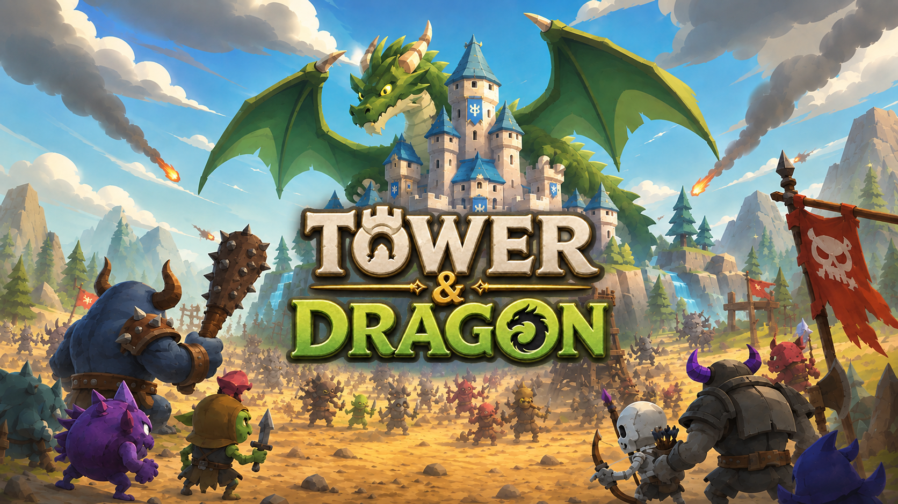
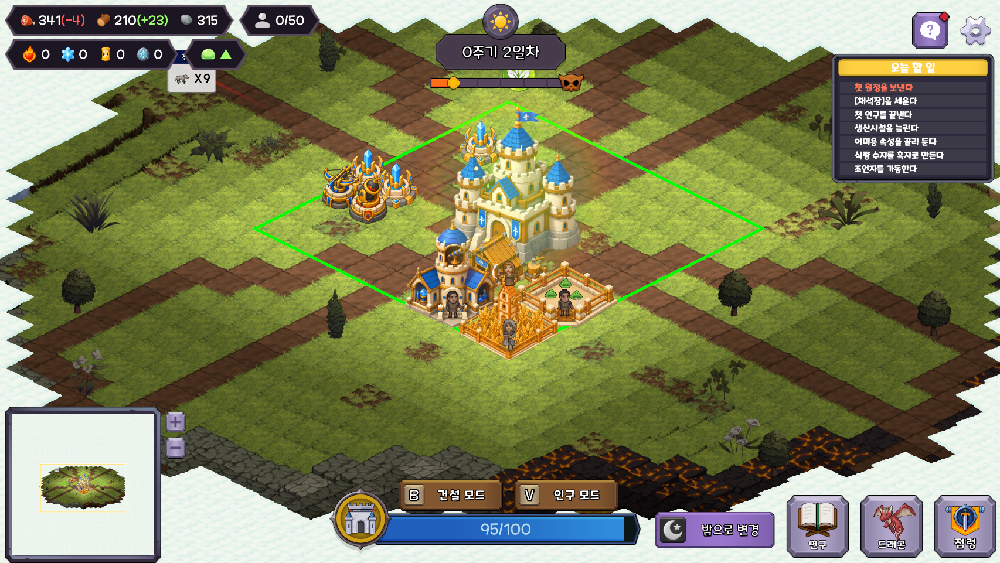
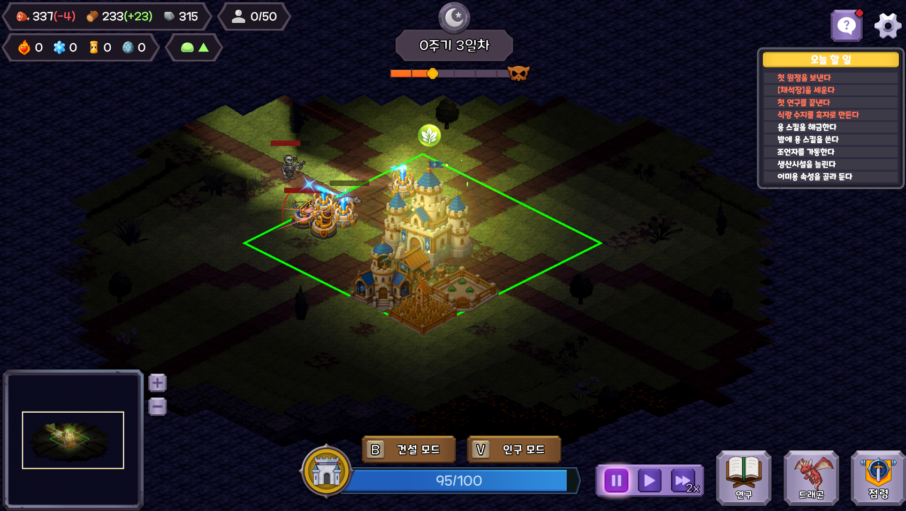
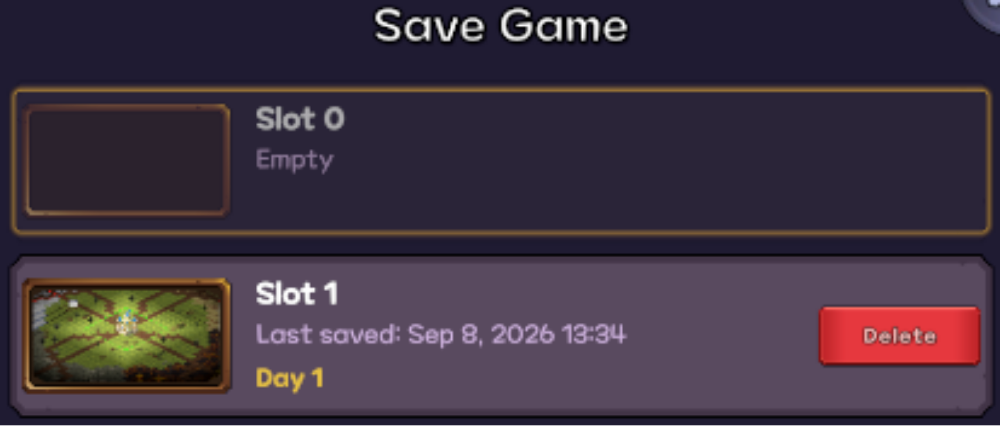
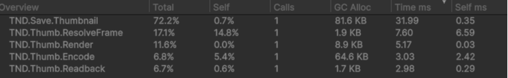
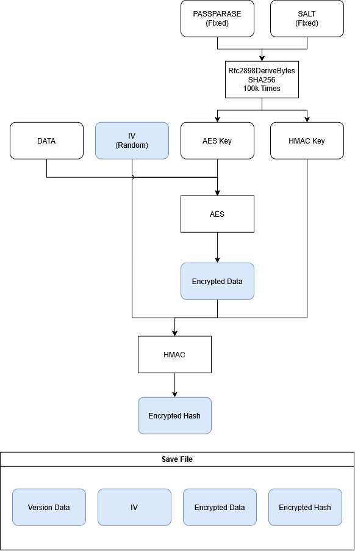
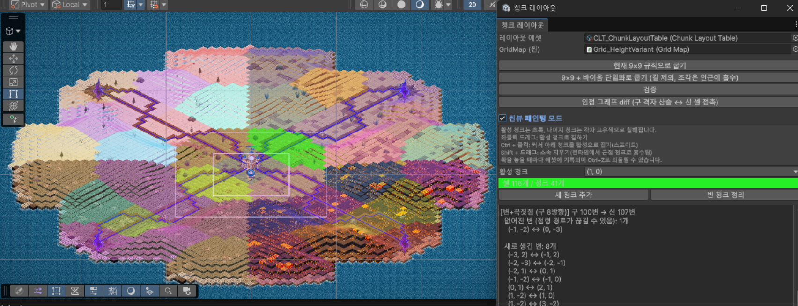
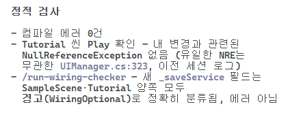

# Tower and Dragon

> **낮의 결정이 밤의 방어를 결정한다.**  
> 한정된 인구를 생산/방어/확장에 배분하고, 용과 함께 도시를 지키는 타워디펜스 게임입니다.

## 프로젝트 개요

| 항목 | 내용 |
| --- | --- |
| 장르 | 타워디펜스 / 도시건설 |
| 플랫폼 | Windows / PC, 싱글플레이 |
| 개발 기간 | 2026.07.08 ~ 2026.09.04 (약 2개월) |
| 팀 구성 | 프로그래머 4인, 기획 겸업 |
| 개발 환경 | Unity 6000 / C# / Isometric Tilemap |
| 주요 기술 | ScriptableObject / CSV / Input System / UniTask |
| 프로젝트 경험 | 기업협약 프로젝트 / STOVE 스토어 출시 |

## 게임 플레이

| 낮: 도시 운영과 방어 준비 | 밤: 타워와 용으로 적 방어 |
| :---: | :---: |
|  |  |

낮에는 시간 제한 없이 도시를 운영하고, 준비가 끝나면 밤을 시작합니다. 밤에는 타워의 자동 전투와 용의 액티브 스킬로 적을 막습니다. 방어에 성공하면 자원을 정산하고 다음 날을 준비합니다.

| 단계 | 플레이어의 선택 |
| --- | --- |
| 낮: 운영과 준비 | 건설, 인구 배치, 점령 출발, 연구 및 용 스킬트리 해금 |
| 밤: 방어 | 포탈에서 진격하는 적을 방어하고 용의 액티브 스킬 사용 |
| 밤 종료 후: 정산 | 자원 생산 / 유지비와 점령 진행도 반영 |

- **인구 배분:** 생산/방어/점령에 투입할 인구 사이에서 우선순위를 정합니다.
- **확장의 대가:** 영토를 넓혀 인구와 자원을 확보하지만, 적 또한 강해집니다.
- **용의 성장:** 속성과 스킬트리 선택을 통해 그 날의 방어 전략을 구성합니다.
- **승리와 패배:** 최종 웨이브를 막아내거나 네 포탈의 봉인석 건설을 완료하면 승리하며, 메인 성이 파괴되면 패배합니다.

## 팀 구성과 담당 역할

| 이름 | 주요 담당 |
| --- | --- |
| **조강현 (본인)** | **팀장(PM), 코드 리뷰, 월드, 시스템 인프라** |
| 김지해 | UI/UX, 연출 |
| 이하늘 | 낮 운영, 튜토리얼 |
| 나상욱 | 밤 전투, 밸런싱, 연구, 스킬트리 |

### 본인 기여 요약

| 영역 | 담당 내용 |
| --- | --- |
| 저장/로드 | 상태 캡처 / 복원, 자동저장 시점, 파일 저장, 썸네일, 세이브 암호화 |
| 월드 / 라이팅 | 청크 편집기, 장식물 가시성, 전장의 안개, 낮/밤 조명 전환 |
| 인 게임 온보딩 | 도움말, 가이드 퀘스트 |
| 공용 도구 | 인스펙터 참조 검사기, 로컬라이징 CSV 다운로드, 반복 검증용 스킬 |
| PM / 코드 리뷰 | 마일스톤 및 이슈 관리, PR 검토, 빌드 전 통합 테스트, 통합 과정의 버그 수정 |

## 주요 구현과 문제 해결

### 1. 저장/로드 — 정산을 중복 실행하지 않는 상태 복원

  

*세이브 슬롯에 썸네일·저장 시각·진행 일차를 표시한 화면입니다.*

저장과 복원 시점이 낮/밤 전환의 정산 순서와 어긋나면, 이어하기 과정에서 자원이 다시 지급되는 문제가 있었습니다. 저장할 데이터뿐 아니라 **어떤 단계가 끝난 상태를 저장하고, 어디서 재개할지**를 명시했습니다.

- 자동저장은 생산 / 유지비 등 정산이 끝난 `OnDaySettled`에서 실행합니다.
- 복원 후에는 `StartDay` 대신 `ResumeDay`로 진입해 생산 / 소비 정산을 다시 실행하지 않습니다.
- 상태 캡처, 복원, 파일 입출력을 각각 분리해 게임 상태와 디스크 처리의 책임을 나눴습니다.

**관련 코드:** [SaveService](Assets/Scripts/Save/SaveService.cs) / [SaveCapture](Assets/Scripts/Save/SaveCapture.cs) / [SaveRestore](Assets/Scripts/Save/SaveRestore.cs) / [CycleManager](Assets/Scripts/Managers/CycleManager.cs)

#### 자동저장 프레임의 작업 분산

정산 직후 저장하도록 수정한 뒤에는, 이미 작업이 많은 전환 프레임에 썸네일 생성까지 겹쳐 끊김이 발생했습니다. `ProfilerMarker`로 상태 캡처/직렬화/썸네일 처리를 나누고, 썸네일 내부도 렌더링/읽기/인코딩 단계로 구분해 병목을 확인했습니다.

*병목 확인 당시의 Profiler 캡처입니다. `TND.Save.Thumbnail`과 하위 단계의 처리 비용을 확인했습니다.*

게임 진행에 영향을 주는 **상태 데이터는 정산 직후 확정**하고, 표시용 **썸네일은 3프레임 뒤에 생성**하도록 분리했습니다. 파일 쓰기는 스레드풀로 넘겼습니다. 썸네일과 저장 상태 사이의 짧은 시각적 차이를 허용해 전환 프레임에 작업이 집중되는 것을 줄였습니다.

**관련 코드:** [SaveThumbnailCapturer](Assets/Scripts/Save/SaveThumbnailCapturer.cs) / [SaveService](Assets/Scripts/Save/SaveService.cs)

#### 파일 저장과 변조 검증

- 임시 파일 쓰기를 완료한 뒤 기존 파일을 `File.Replace`로 교체합니다. 첫 저장은 `File.Move`로 처리해 파일을 쓰는 도중 기존 세이브를 훼손할 위험을 줄였습니다.
- Rfc2898DeriveBytes(PBKDF2-SHA256)으로 암호화용/인증용 키를 분리해 유도하고, AES-256-CBC/Base64와 매번 새로 생성하는 IV로 세이브 본문과 메타데이터를 암호화합니다.
- HMAC-SHA256으로 포맷 식별자/IV/암호문을 검증합니다.

**관련 코드:** [SaveFileStore](Assets/Scripts/Save/SaveFileStore.cs) / [SaveCrypto](Assets/Scripts/Save/SaveCrypto.cs)  

### 2. 월드 / 라이팅 — 제작 편의와 화면 가독성

아이소메트릭 타일맵에 높낮이와 장식물을 적용하면서, 게임 규칙에 사용하는 청크 데이터와 화면에 보이는 표현을 함께 관리했습니다.

*청크를 색상으로 구분하고, 선택한 청크의 셀과 인접 관계를 확인하며 레이아웃을 편집합니다.*

- **청크 편집기:** 점령 단위인 청크의 레이아웃을 에디터에서 수정할 수 있도록 전용 창을 제작했습니다.
- **장식물 가시성:** 건물과 일정 거리 이내의 장식물을 숨깁니다. 연속으로 발생하는 셀 변경 이벤트는 갱신 예약으로 묶어 프레임당 한 번 재계산합니다.
- **낮/밤 전환:** `Light2D`를 낮/밤 이벤트에 연결하고 색과 밝기를 보간합니다. 전환 중 노을색을 거치도록 하되, 게임 시작이나 복원 직후에는 목표 조명을 즉시 적용해 불필요한 전환 연출을 방지했습니다.
- **전투 가독성:** 타워가 조준하는 방향을 라이트로 표시했습니다.

**관련 코드:**  
	[ChunkLayoutEditorWindow](Assets/Scripts/Grid/Editor/ChunkLayoutEditorWindow.cs) : 청크 레이아웃 수정  
	[PropVisibilityController](Assets/Scripts/Grid/PropVisibilityController.cs) : 장식물 자동 숨김 
	[CycleLight](Assets/Scripts/Lighting/CycleLight.cs) : 라이트 낮/밤 전환 
	[TowerLightAimer](Assets/Scripts/Buildings/Tower/TowerLightAimer.cs) : 타워 스포트라이트 

### 3. Wiring Checker — 반복되는 씬 참조 누락을 검사 도구로 해결

씬 분리와 협업 과정에서 인스펙터 참조가 누락되거나 끊기는 문제가 반복됐습니다. 컴파일만으로 발견하기 어렵고 수동 확인 비용도 커서, **플레이 전에 씬 데이터를 검사하는 에디터 도구**를 제작했습니다.

| 검사 대상 | 확인 내용 |
| --- | --- |
| 스크립트 연결 | Missing Script, 소유 스크립트를 찾을 수 없는 GUID |
| 직렬화 참조 | 비어 있는 필수 참조, 대상이 삭제된 참조, 중첩 필드/배열 원소 |
| UnityEvent | 영속 리스너의 대상 누락, 메서드명 누락 |
| 선택적 참조 | `[WiringOptional]`로 표시한 필드는 경고로 구분 |

빌드 설정에서 활성화된 씬들을 검사하고 오브젝트/컴포넌트/필드 위치를 포함한 결과를 출력합니다. AI가 씬을 매번 탐색하는 대신 검사 스크립트를 실행하고 결과를 읽도록 반복 검증 절차에도 연결했습니다.

*검사 결과를 요약한 예시입니다. 두 씬의 `_saveService` 참조가 `WiringOptional`에 따라 경고로 구분됐는지 확인합니다.*

**관련 코드:** [WiringChecker](Assets/Scripts/Util/Editor/WiringChecker.cs) / [WiringCheckerRunner](Assets/Scripts/Util/Editor/WiringCheckerRunner.cs) / [WiringOptionalAttribute](Assets/Scripts/Util/WiringOptionalAttribute.cs)

### 4. 공용 도구와 협업

팀장으로서 마일스톤을 설정하고 이슈를 생성/분배했으며, PR 코드 리뷰와 빌드 전 통합 테스트를 진행했습니다. 담당 영역이 맞닿는 부분에서 발생한 버그를 수정하고, 반복되는 문제는 팀 규칙과 검증 절차에 반영했습니다.

- **로컬라이징:** Google Sheets의 번역 값을 CSV로 내려받는 에디터 도구를 제작했습니다. 로컬 CSV의 추가/변경 키를 시트에 옮기기 위한 스킬도 마련했습니다.
- **AI 활용:** 코드 작성과 리뷰 보조에 AI를 활용하고, 직접 코드 검토와 통합 테스트를 병행했습니다. 반복 탐색이 필요한 검사는 실행 가능한 도구로 옮겼습니다.
- **공통 규칙:** 문자열의 스트링테이블 분리, 상수/변수 네이밍, 인스펙터 참조 검증 등 협업 기준을 정리했습니다.

**관련 코드:** [CsvDownloader](Assets/Scripts/Util/Editor/CsvDownloader.cs) / [StringTable](Assets/Scripts/Util/StringTable.cs)

## 프로젝트 실행
[STOVE를 통해 플레이]()
